# NATS Architecture Diagram

## Introduction

This document explains the communication architecture for PUDA (Physical Unit Data Acquisition) machines using NATS (NATS Messaging System). If you're new to NATS or microservices architecture, this section will help you understand the fundamentals.

### What is NATS?

**NATS** is a lightweight, high-performance messaging system that enables applications to communicate with each other. Think of it as a **message bus** or **postal service** for your applications:

- **Publishers** send messages to specific **subjects** (like mailing addresses)
- **Subscribers** listen to subjects and receive messages
- The NATS server routes messages from publishers to subscribers

### What is a Microservices Architecture?

In a **microservices architecture**, a large application is broken down into smaller, independent services that communicate over a network. Instead of one monolithic application, you have:

- **Multiple services** that can be developed, deployed, and scaled independently
- **Loose coupling** - services don't need to know about each other's internal implementation
- **Message-based communication** - services communicate by sending messages rather than direct function calls

### Why Use NATS for Machine Communication?

This system uses NATS because:

1. **Decoupling**: Command senders don't need to know which machines are online or where they are
2. **Reliability**: Messages are persisted and guaranteed to be delivered (using JetStream)
3. **Scalability**: Can handle many machines and many command senders simultaneously
4. **Flexibility**: New services can subscribe to telemetry or events without modifying existing code
5. **Resilience**: If a machine disconnects, messages wait in queues until it reconnects

## Core Concepts

### Subjects (Message Addresses)

A **subject** is like an address or topic name. Messages are published to subjects, and subscribers listen to subjects.

**Subject Pattern**: `puda.{machine_id}.{category}.{sub_category}`

Example: `puda.first-machine.tlm.heartbeat`
- `puda` - namespace (all PUDA messages)
- `first-machine` - which machine
- `tlm` - category (telemetry)
- `heartbeat` - specific type

### Publish/Subscribe (Pub/Sub)

The basic NATS pattern:

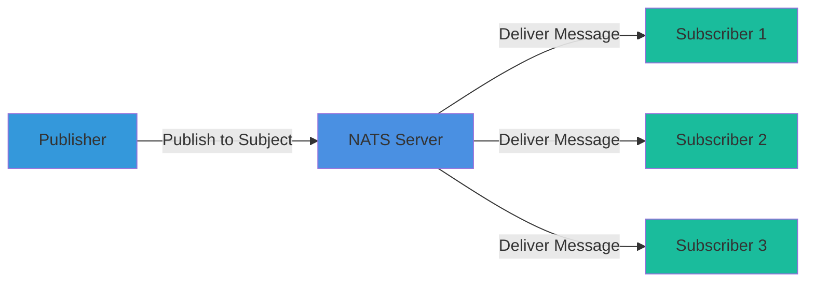

**Key Points**:
- One publisher can reach many subscribers
- Publishers and subscribers don't know about each other
- If no one is listening, the message is dropped (unless using JetStream)

### Core NATS vs JetStream

This system uses two NATS features:

#### Core NATS (Fire-and-Forget)
- **Lightweight** - no persistence
- **Fast** - minimal overhead
- **Best for**: Telemetry, events, real-time data
- **Behavior**: If no subscriber is listening, message is lost

#### JetStream (Persistent Messaging)
- **Persistent** - messages are stored
- **Reliable** - guaranteed delivery
- **Best for**: Commands, responses, critical data
- **Behavior**: Messages wait in streams until subscribers process them

### Streams and WorkQueue Retention

A **stream** is like a message queue that stores messages:

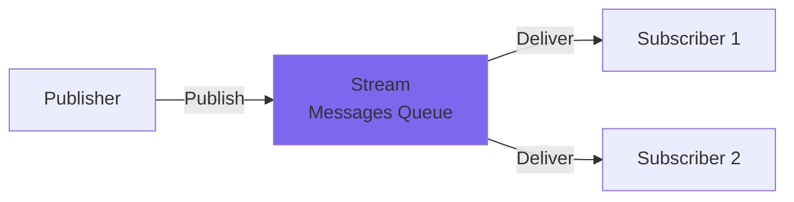

**WorkQueue Retention** means:
- Each message is delivered to **exactly one subscriber**
- Once processed and acknowledged, the message is removed
- Ensures **exactly-once processing** - no duplicate work
- Perfect for commands that should only be executed once

### Microservices Architecture Overview

Here's how this system fits into a microservices architecture:

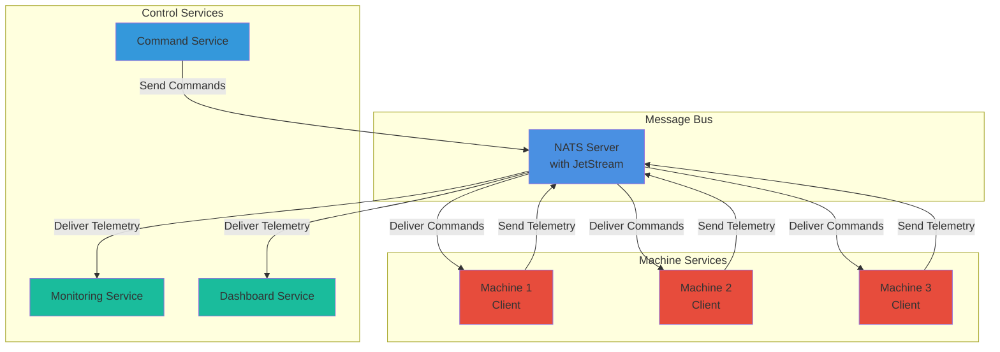

**Benefits**:
- **Independent scaling**: Add more machines without changing control services
- **Fault tolerance**: If one service fails, others continue working
- **Easy integration**: New services can subscribe to existing messages
- **Location independence**: Services can run anywhere on the network

## System Architecture

```mermaid
graph TB
    subgraph "NATS Server Cluster"
        NATS[NATS Core Server]
        JS[JetStream]
        KV[Key-Value Store]
    end

    subgraph "Machine Client"
        MC[MachineClient]
        MC -->|Connect| NATS
        MC -->|JetStream Context| JS
        MC -->|KV Bucket| KV
    end

    subgraph "Command Streams (JetStream)"
        CQ[COMMAND_QUEUE Stream<br/>WorkQueue Retention<br/>puda.*.cmd.queue]
        CI[COMMAND_IMMEDIATE Stream<br/>WorkQueue Retention<br/>puda.*.cmd.immediate]
        JS --> CQ
        JS --> CI
    end

    subgraph "Response Streams (JetStream)"
        RQ[RESPONSE_QUEUE Stream<br/>WorkQueue Retention<br/>puda.*.cmd.response.queue]
        RI[RESPONSE_IMMEDIATE Stream<br/>WorkQueue Retention<br/>puda.*.cmd.response.immediate]
        JS --> RQ
        JS --> RI
    end

    subgraph "Machine Side"
        MACHINE[Machine<br/>e.g., First Machine]
        MC -->|Subscribe Queue| CQ
        MC -->|Subscribe Immediate| CI
        MC -->|Publish Queue Responses| RQ
        MC -->|Publish Immediate Responses| RI
        MC -->|Publish Status| KV
        MC -->|Publish Telemetry<br/>(Fire-and-Forget)| NATS
        MC -->|Publish Events<br/>(Fire-and-Forget)| NATS
        MACHINE --> MC
    end

    subgraph "Command Sender"
        SENDER[Command Sender<br/>Test Scripts]
        SENDER -->|Publish Commands| CQ
        SENDER -->|Publish Immediate| CI
        SENDER -->|Subscribe Queue Responses| RQ
        SENDER -->|Subscribe Immediate Responses| RI
    end

    subgraph "Telemetry Subscribers"
        TLM_SUB[Telemetry Subscribers]
        TLM_SUB -->|Subscribe| NATS
    end

    subgraph "Core NATS Subjects (Fire-and-Forget, No JetStream)"
        TLM_HEARTBEAT[puda.{machine_id}.tlm.heartbeat]
        TLM_POS[puda.{machine_id}.tlm.pos]
        TLM_HEALTH[puda.{machine_id}.tlm.health]
        EVT_LOG[puda.{machine_id}.evt.log]
        EVT_ALERT[puda.{machine_id}.evt.alert]
        EVT_MEDIA[puda.{machine_id}.evt.media]
        
        NATS --> TLM_HEARTBEAT
        NATS --> TLM_POS
        NATS --> TLM_HEALTH
        NATS --> EVT_LOG
        NATS --> EVT_ALERT
        NATS --> EVT_MEDIA
    end

    style NATS fill:#4A90E2,stroke:#2E5C8A,stroke-width:2px
    style JS fill:#7B68EE,stroke:#5A4FCF,stroke-width:2px
    style KV fill:#FF6B6B,stroke:#CC5555,stroke-width:2px
    style CQ fill:#50C878,stroke:#3A9D5F,stroke-width:2px
    style CI fill:#FFA500,stroke:#CC8500,stroke-width:2px
    style RQ fill:#20B2AA,stroke:#178B85,stroke-width:2px
    style RI fill:#FFD700,stroke:#CCAA00,stroke-width:2px
    style MC fill:#9B59B6,stroke:#7D3C98,stroke-width:2px
    style MACHINE fill:#E74C3C,stroke:#C0392B,stroke-width:2px
    style SENDER fill:#3498DB,stroke:#2980B9,stroke-width:2px
    style TLM_SUB fill:#1ABC9C,stroke:#16A085,stroke-width:2px
```

## How It Works (Simple Overview)

Here's a simplified view of how commands flow through the system:

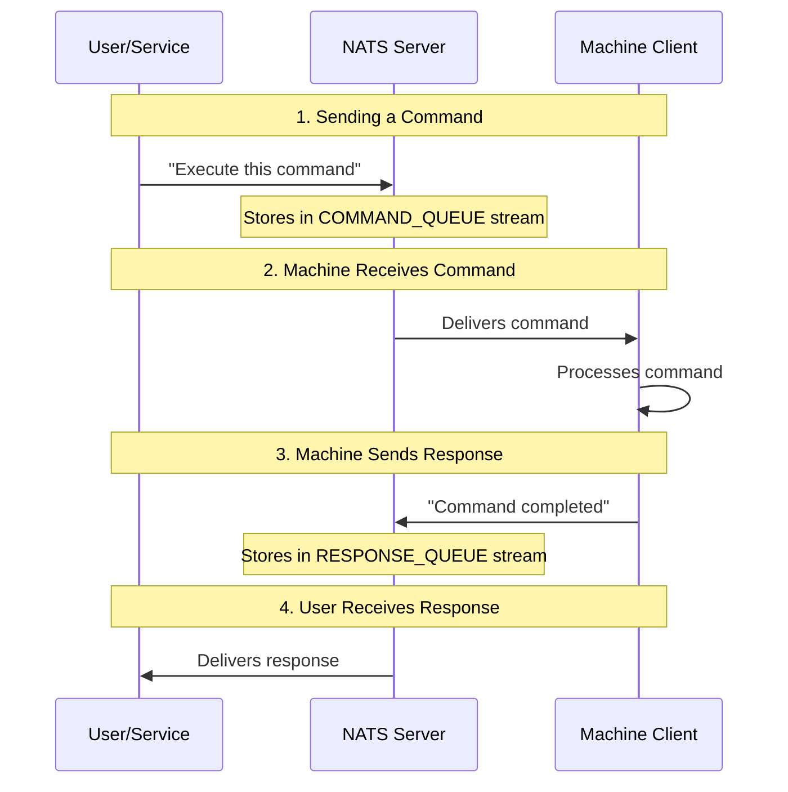

**Key Points**:
- Commands are **persisted** in streams, so they survive disconnections
- Each command is processed **exactly once** (WorkQueue ensures this)
- Responses follow the same reliable pattern
- Telemetry uses lightweight messaging (no persistence needed)

## Architecture Overview

### Subject Pattern
All subjects follow: `puda.{machine_id}.{category}.{sub_category}`

**Why this pattern?**
- **Namespace** (`puda`) - Prevents conflicts with other systems
- **Machine ID** - Routes messages to specific machines
- **Category** - Groups related messages (cmd, tlm, evt)
- **Sub-category** - Specific message type

This allows flexible subscription patterns:
- `puda.*.tlm.*` - All telemetry from all machines
- `puda.first-machine.*` - Everything from one machine
- `puda.*.evt.alert` - All alerts from all machines

### Message Types

This system uses **5 types of messages**, each optimized for its purpose:

#### 1. **Telemetry (Core NATS - Fire-and-Forget)**

**What is it?** Real-time status updates from machines (like sensor readings).

**Why Fire-and-Forget?**
- Telemetry is **high-frequency** (sent many times per second)
- **Real-time** - old data isn't useful
- **Lightweight** - no persistence overhead
- If a subscriber misses a message, the next one comes soon

**Subjects**:
- `puda.{machine_id}.tlm.heartbeat` - Periodic heartbeat (machine is alive)
- `puda.{machine_id}.tlm.pos` - Position coordinates (where the machine is)
- `puda.{machine_id}.tlm.health` - System health vitals (CPU, memory, temperature)

**Example Flow**:
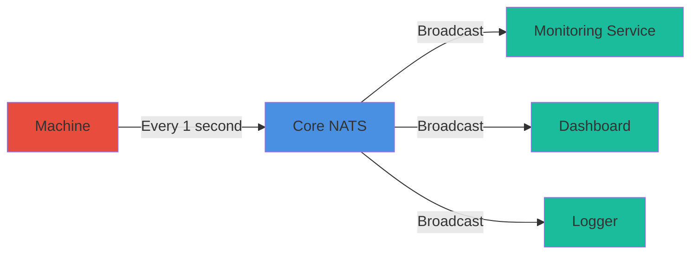

#### 2. **Commands (JetStream - Exactly-Once Delivery)**

**What is it?** Instructions sent to machines to perform actions.

**Why JetStream?**
- Commands **must be delivered** - can't lose them
- Commands **must be processed once** - don't want duplicates
- Commands **must persist** - survive machine disconnections

**Two Types of Commands:**

**Queue Commands** (Sequential Processing):
- Stream: `COMMAND_QUEUE`
- Subject: `puda.{machine_id}.cmd.queue`
- Retention: **WorkQueue** (ensures exactly-once processing)
- Used for: Execute commands that need to be processed **one at a time, in order**
- Example: "Move to position X, then Y, then Z" - must happen in sequence

**Immediate Commands** (Priority Actions):
- Stream: `COMMAND_IMMEDIATE`
- Subject: `puda.{machine_id}.cmd.immediate`
- Retention: **WorkQueue** (ensures exactly-once processing)
- Used for: **Pause, Resume, Cancel** - actions that need immediate attention
- Example: "Stop everything immediately!" - needs to interrupt queue processing

**Why Two Streams?**
- **Queue commands** are processed sequentially (one after another)
- **Immediate commands** can interrupt queue processing
- This separation allows **priority handling** without blocking normal operations

**Visual Example**:
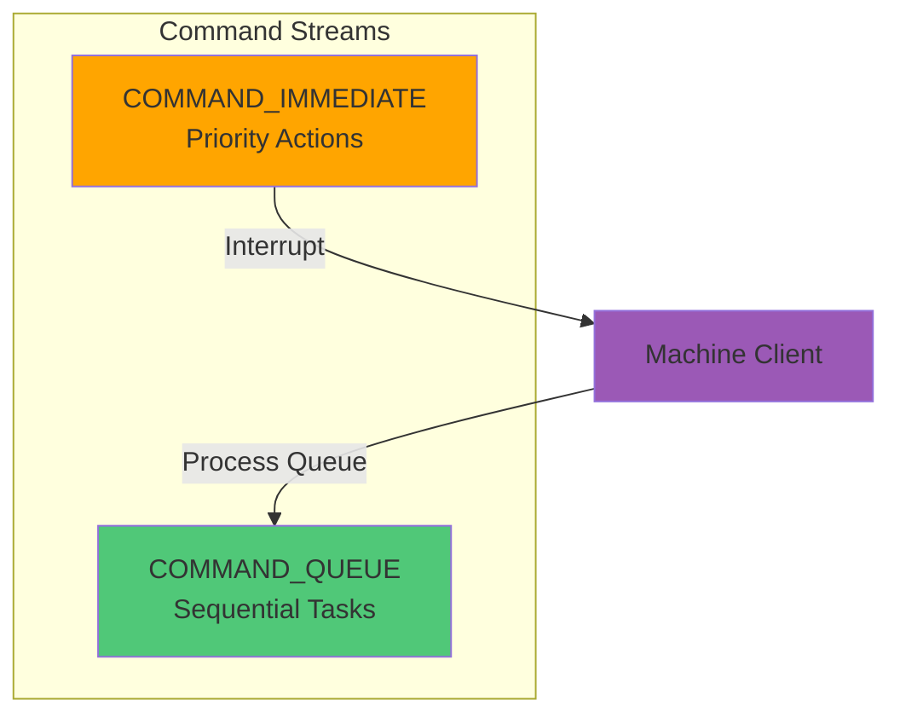

#### 3. **Command Responses (JetStream - Exactly-Once Delivery)**

**What is it?** Confirmation messages sent back from machines after processing commands.

**Why Separate Response Streams?**
- Responses **must be delivered** to the command sender
- Responses **must be processed once** - don't want duplicate acknowledgments
- Responses **must persist** - survive network issues

**Two Response Streams** (matching the command types):

**Queue Command Responses:**
- Stream: `RESPONSE_QUEUE`
- Subject: `puda.{machine_id}.cmd.response.queue`
- Retention: **WorkQueue** (ensures exactly-once processing)
- Used for: Responses to queue commands
- Contains: Success/failure status, completion time, error messages

**Immediate Command Responses:**
- Stream: `RESPONSE_IMMEDIATE`
- Subject: `puda.{machine_id}.cmd.response.immediate`
- Retention: **WorkQueue** (ensures exactly-once processing)
- Used for: Responses to immediate commands
- Contains: Confirmation that pause/resume/cancel was executed

**Why WorkQueue?**
- Ensures the command sender receives the response **exactly once**
- Prevents duplicate processing of responses
- Guarantees reliable command-response pairing

#### 4. **Events (Core NATS - Fire-and-Forget)**

**What is it?** Notifications about things that happened (like log entries or alerts).

**Why Fire-and-Forget?**
- Events are **informational** - not critical for operation
- **High volume** - many events can be generated
- **Real-time** - old events aren't as useful
- Multiple services can listen without coordination

**Subjects**:
- `puda.{machine_id}.evt.log` - Log events (informational messages)
- `puda.{machine_id}.evt.alert` - Alert events (warnings, errors)
- `puda.{machine_id}.evt.media` - Media events (images, videos captured)

**Example Use Cases**:
- Logging service subscribes to all `*.evt.log` subjects
- Alerting service subscribes to all `*.evt.alert` subjects
- Media storage service subscribes to all `*.evt.media` subjects

#### 5. **Status (JetStream KV Store)**

**What is it?** Current state of each machine, stored as key-value pairs.

**Why KV Store?**
- **Fast lookups** - "What's the status of machine X?" (instant answer)
- **Persistent** - Status survives server restarts
- **Simple** - Just key-value pairs, no complex queries needed

**Storage**:
- Bucket: `MACHINE_STATE_{machine_id}` (one bucket per machine)
- Key: `{machine_id}`
- Value: JSON with current state (idle/busy/error), run_id, timestamp

**Example**:
```json
{
  "state": "busy",
  "run_id": "run-12345",
  "timestamp": "2024-01-15T10:30:00Z"
}
```

**Use Cases**:
- Dashboard shows current status of all machines
- Monitoring service checks if machines are stuck
- Load balancer routes commands based on machine availability

### Flow Diagrams

These diagrams show the **step-by-step flow** of messages through the system.

#### Telemetry Flow

This shows how **telemetry** (sensor data, position, health) flows from machines to subscribers:

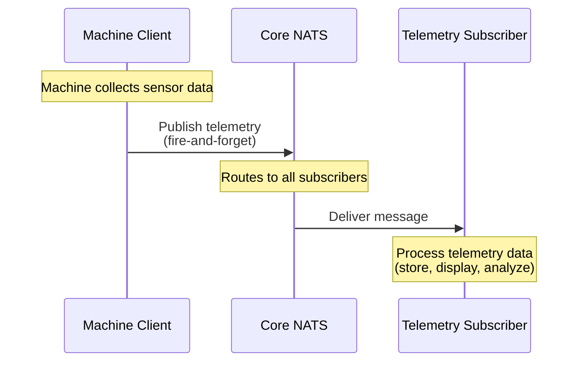

**Key Points**:
- **No persistence** - if subscriber is offline, message is lost (but next one comes soon)
- **Broadcast** - one message reaches all subscribers
- **High frequency** - machines send telemetry many times per second

#### Command Execution Flow

This shows how a **queue command** (like "execute a routine") flows through the system:
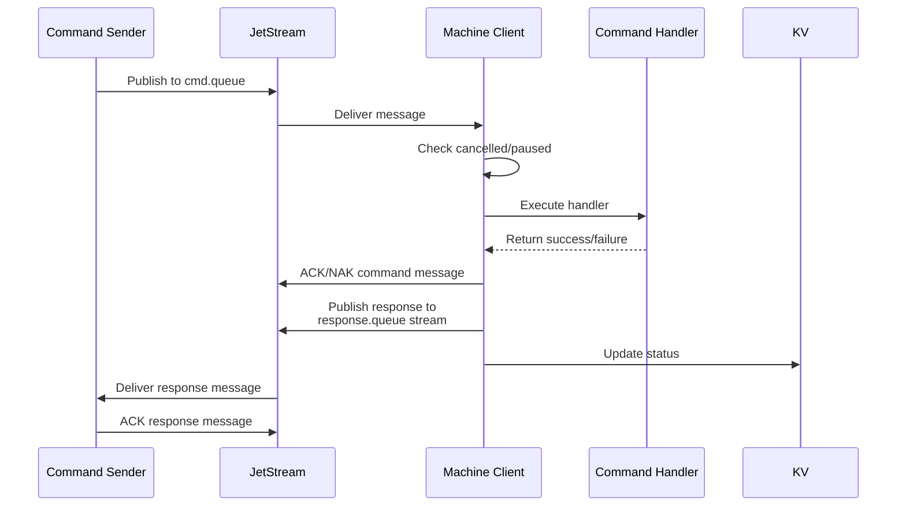

#### Immediate Command Flow (JetStream)

This shows how **immediate commands** (pause, resume, cancel) flow through the system:

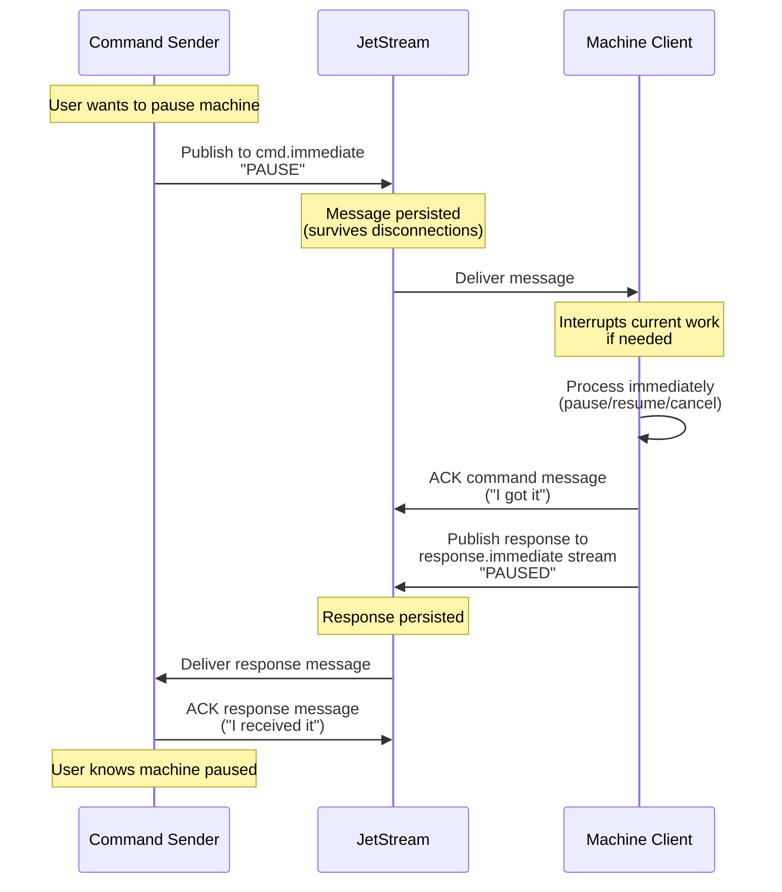

**Key Points**:
- **Persistent** - command survives machine disconnection
- **Immediate** - interrupts queue processing if needed
- **Reliable** - sender gets confirmation that command was executed

### Key Features

1. **Exactly-Once Delivery**: All commands and responses use JetStream with WorkQueue retention
   - Each command is processed **exactly once**, never duplicated
   - Prevents machines from executing the same command multiple times

2. **Keep-Alive**: Messages send periodic `in_progress()` signals during long-running operations
   - Long-running commands send "still working" signals every 25 seconds
   - Prevents timeouts and shows progress

3. **Cancellation**: Commands can be cancelled by run_id
   - If a command is taking too long, it can be cancelled
   - Machine checks cancellation status before executing each command

4. **Pause/Resume**: Queue processing can be paused and resumed
   - Machines can pause command processing (e.g., for maintenance)
   - Commands wait in queue until processing resumes

5. **Auto-Reconnection**: Client automatically reconnects and resubscribes
   - If network connection is lost, client automatically reconnects
   - Subscriptions are restored, and pending messages are delivered

6. **Status Tracking**: Machine state stored in KV store for quick lookup
   - Fast "what's the status?" queries without scanning streams
   - Useful for dashboards and monitoring

7. **Four Streams Per Machine**: Two command streams (queue and immediate) and two response streams (queue and immediate) ensure reliable command-response communication
   - Separation allows priority handling (immediate commands interrupt queue)
   - Each stream optimized for its purpose

8. **Fire-and-Forget**: Telemetry and events use Core NATS for lightweight, non-persistent messaging
   - High-frequency data doesn't need persistence
   - Reduces overhead and improves performance

## Common Use Cases

### Use Case 1: Sending a Command to Execute a Routine

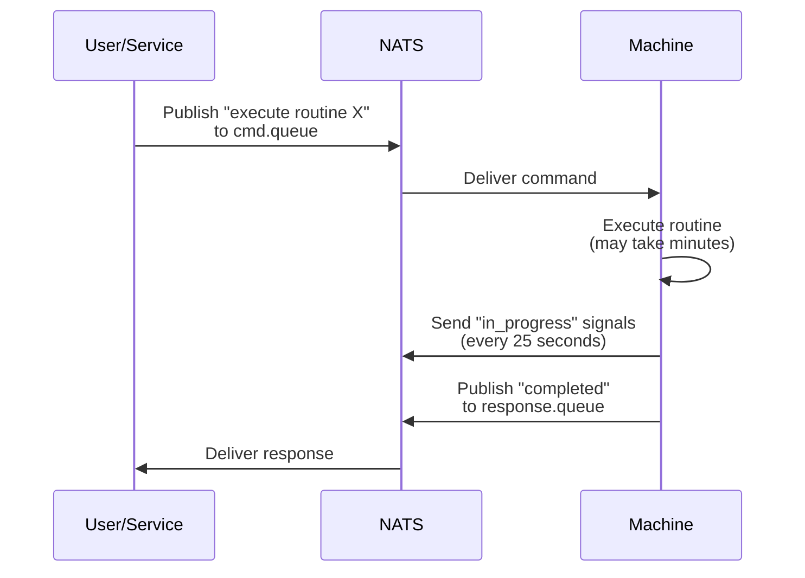

### Use Case 2: Monitoring Machine Health

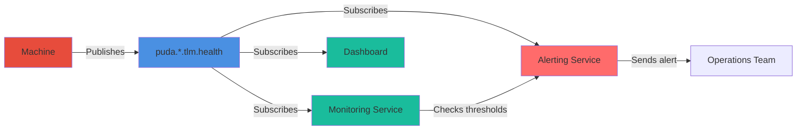

### Use Case 3: Emergency Stop

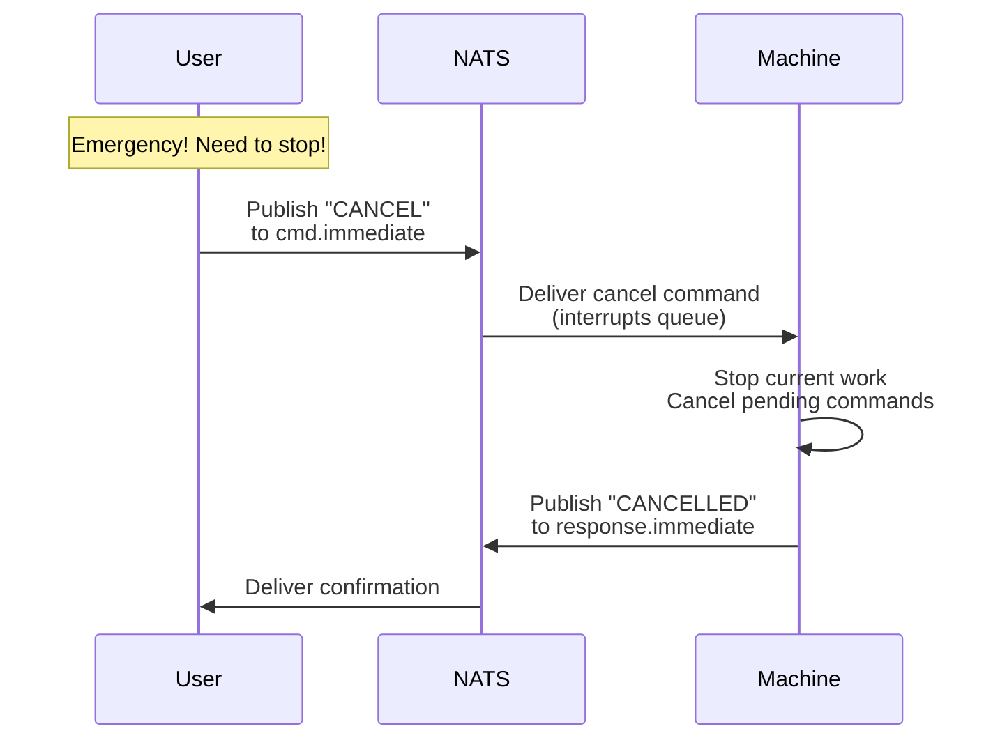

## Summary

This architecture provides:

✅ **Reliability** - Commands and responses are never lost  
✅ **Scalability** - Add machines or services without code changes  
✅ **Flexibility** - New services can subscribe to existing messages  
✅ **Performance** - Lightweight telemetry, persistent commands  
✅ **Resilience** - Survives network issues and disconnections  
✅ **Simplicity** - Clear separation of concerns (commands, telemetry, events)

