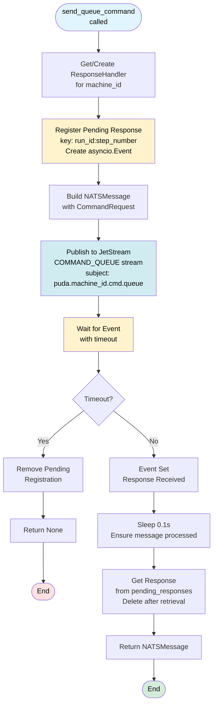
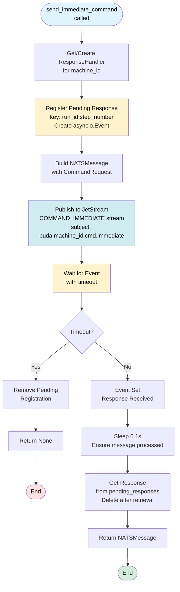
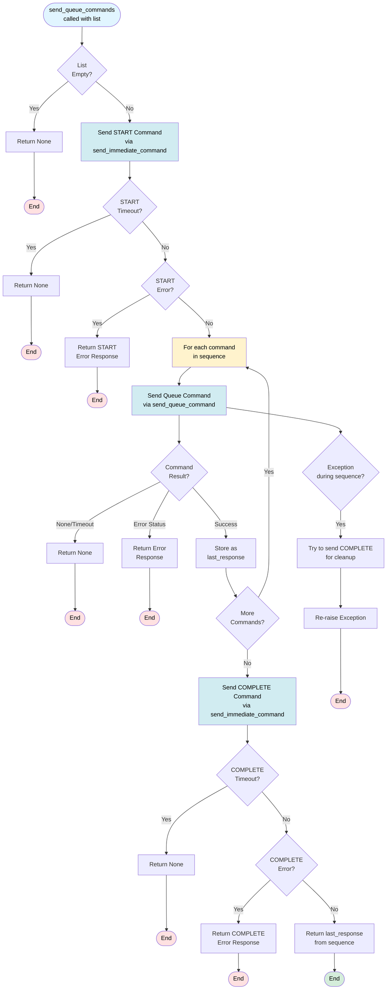
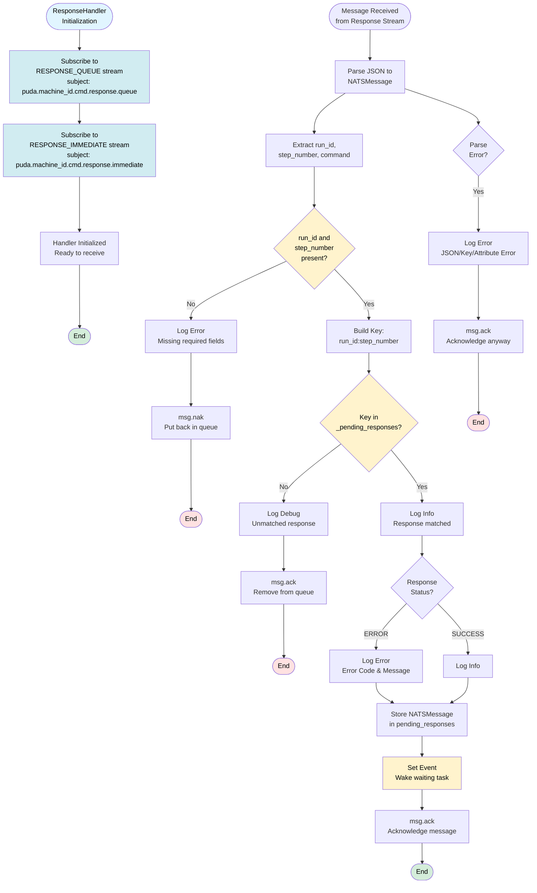
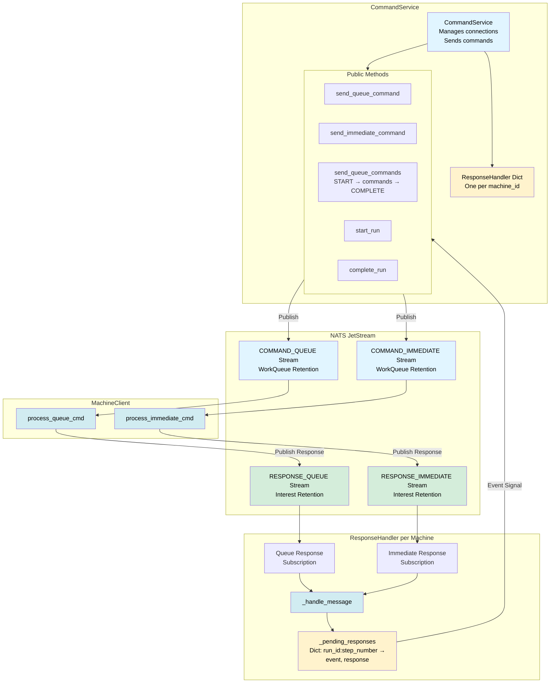

# CommandService Message Flow

This diagram shows how `CommandService` sends commands to machines via NATS and handles responses.

## Queue Command Flow

## Immediate Command Flow

## Sequential Commands Flow

## Response Handler Flow

## Complete Architecture Overview

## Key Features

### CommandService
- **Connection Management**: Connects to NATS with retry logic (3 attempts, 3s timeout each)
- **Response Handler Management**: Creates and manages one ResponseHandler per machine_id
- **Command Sending**:
  - `send_queue_command`: Sends single queue command, waits for response
  - `send_immediate_command`: Sends immediate command (PAUSE, RESUME, CANCEL, START, COMPLETE)
  - `send_queue_commands`: Sends sequence with automatic START/COMPLETE wrapper
- **Helper Methods**:
  - `start_run`: Convenience method to send START command
  - `complete_run`: Convenience method to send COMPLETE command
- **Error Handling**: Handles timeouts, connection errors, and response errors gracefully
- **Signal Handlers**: Registers SIGTERM/SIGINT for graceful shutdown

### ResponseHandler
- **Per-Machine Handler**: One handler instance per machine_id
- **Dual Subscription**: Subscribes to both RESPONSE_QUEUE and RESPONSE_IMMEDIATE streams
- **Response Matching**: Matches responses to pending commands using `run_id:step_number` key
- **Event-Based Waiting**: Uses asyncio.Event to signal when responses arrive
- **Pending Response Storage**: Stores pending responses in dict with event and response
- **Cleanup**: Removes pending registrations after retrieval or timeout
- **Error Handling**: 
  - NAKs messages with missing required fields (puts back in queue)
  - ACKs unmatched responses (from previous runs/sessions)
  - ACKs parse errors (removes malformed messages)

### Sequential Command Flow
- **Automatic Lifecycle**: Automatically sends START before sequence, COMPLETE after success
- **Sequential Execution**: Sends commands one-by-one, waiting for each response
- **Early Termination**: Stops immediately on any command failure or timeout
- **Error Cleanup**: Attempts to send COMPLETE on exception (for state cleanup)
- **Return Value**: Returns failed command response, or last successful command response

### Response Flow
1. **Registration**: Command sends, registers pending response with event
2. **Publication**: Command published to JetStream stream
3. **Processing**: Machine processes command and publishes response
4. **Matching**: ResponseHandler receives response, matches to pending registration
5. **Signaling**: Event is set, waking waiting task
6. **Retrieval**: Task retrieves response and removes from pending dict

### Timeout Handling
- **Command Timeout**: Default 120 seconds, configurable per command
- **Timeout Behavior**: Removes pending registration, returns None
- **Connection Timeout**: 3 seconds per attempt, 3 attempts total

### Error Scenarios
- **Connection Failure**: Returns False from connect(), raises RuntimeError on command send
- **Response Timeout**: Returns None, removes pending registration
- **Response Error**: Returns NATSMessage with ERROR status
- **Parse Error**: ResponseHandler ACKs malformed messages, logs error
- **Unmatched Response**: ResponseHandler ACKs (likely from previous run/session)

