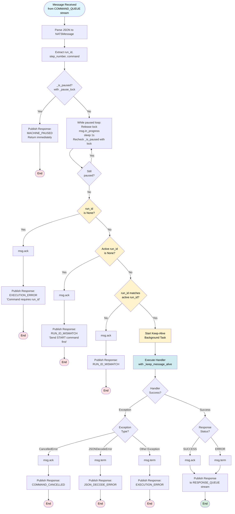
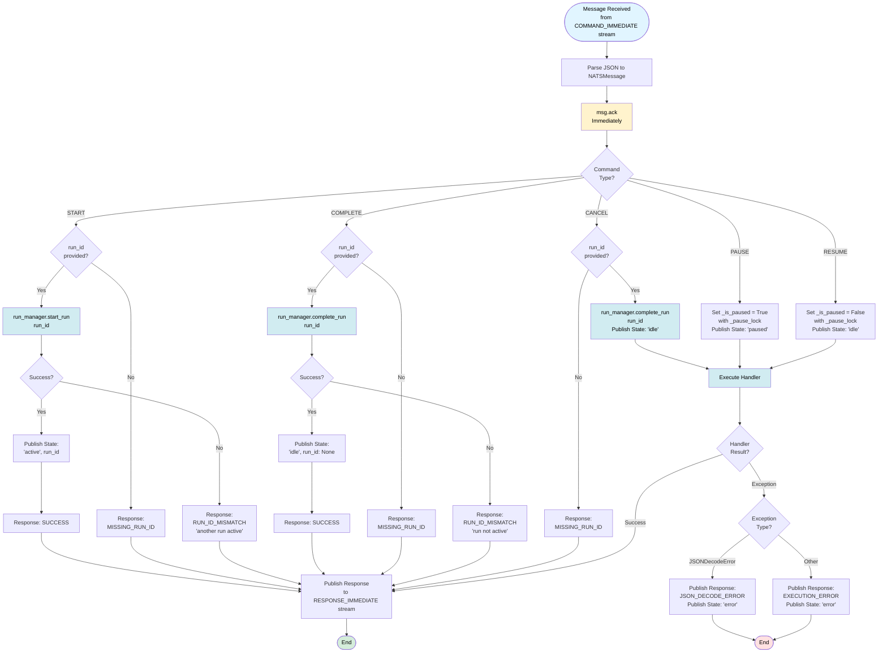
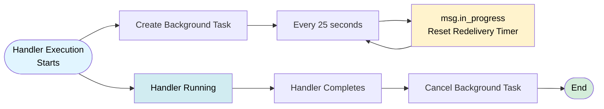
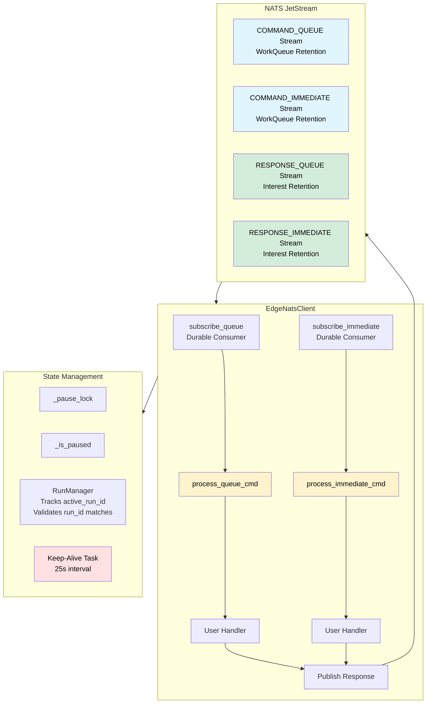

# EdgeNatsClient Message Handling Flow

This diagram shows how `EdgeNatsClient` processes incoming messages from NATS JetStream.

## Queue Commands Flow

## Immediate Commands Flow

## Keep-Alive Mechanism

## Complete Message Flow Overview

## Key Features

### Queue Commands (`process_queue_cmd`)
- **Pause Check**: First checks if paused (with lock), publishes MACHINE_PAUSED response and returns immediately
- **Pause Wait Loop**: If paused, waits in loop (releasing lock, calling in_progress, sleeping 1s) until resumed
- **Run ID Validation**: 
  - Validates run_id is not None
  - Validates active_run_id exists (requires START command first)
  - Validates run_id matches active_run_id using RunManager
- **Keep-Alive**: Background task resets redelivery timer every 25 seconds
- **Ack/Term Logic**: 
  - `msg.ack()` on SUCCESS, CANCELLED, or validation errors
  - `msg.term()` on ERROR (prevents infinite redelivery)
- **Error Handling**: Handles JSON decode errors, cancellation, and execution errors separately

### Immediate Commands (`process_immediate_cmd`)
- **Immediate Ack**: Acknowledges message immediately after parsing
- **Built-in Commands**: 
  - **START**: Uses `run_manager.start_run()` to set active run_id, publishes state 'active'
  - **COMPLETE**: Uses `run_manager.complete_run()` to clear active run_id, publishes state 'idle'
  - **PAUSE**: Sets `_is_paused = True` (with lock), publishes state 'paused', calls handler
  - **RESUME**: Sets `_is_paused = False` (with lock), publishes state 'idle', calls handler
  - **CANCEL**: Uses `run_manager.complete_run()` to clear active run_id, publishes state 'idle', calls handler
- **State Updates**: Publishes machine state to KV store for all built-in commands
- **Error Handling**: Publishes error responses even after ack (since ack already sent)

### Keep-Alive Mechanism
- **Background Task**: Runs independently during handler execution
- **Timer Reset**: Calls `msg.in_progress()` every 25 seconds
- **Auto-Cleanup**: Task is cancelled when handler completes

### Response Publishing
- **Stream Selection**: 
  - Queue commands → `RESPONSE_QUEUE` stream
  - Immediate commands → `RESPONSE_IMMEDIATE` stream
- **Message Transformation**: Converts original message header to RESPONSE type
- **Timestamp**: Adds current timestamp to response header

### Run Management
- **RunManager**: Thread-safe run state management
  - Tracks `active_run_id` for the machine
  - `start_run(run_id)`: Sets active run_id (fails if another run is active)
  - `complete_run(run_id)`: Clears active run_id (fails if run_id doesn't match)
  - `validate_run_id(run_id)`: Checks if run_id matches active run_id
  - `get_active_run_id()`: Returns current active run_id
- **Run Lifecycle**: 
  - START command sets active run_id
  - Queue commands must match active run_id
  - COMPLETE or CANCEL command clears active run_id

