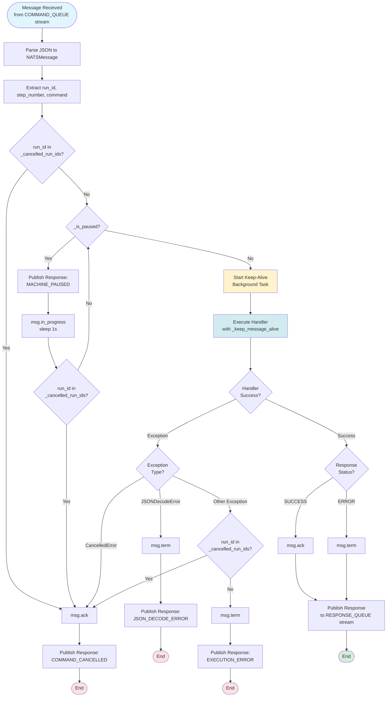
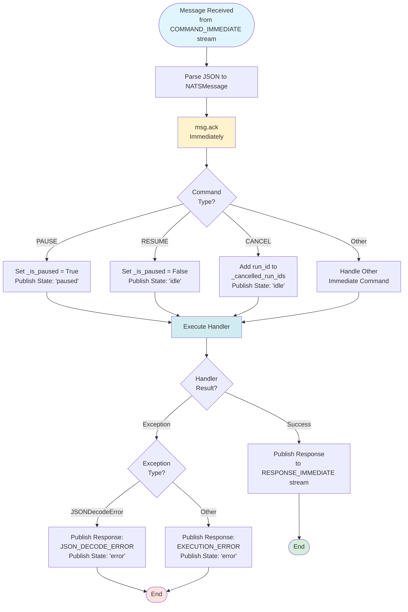
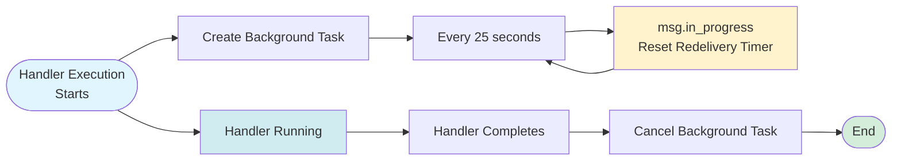
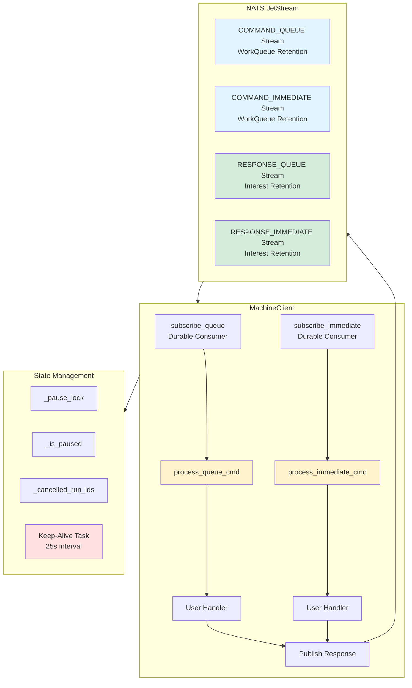

# MachineClient Message Handling Flow

This diagram shows how `MachineClient` processes incoming messages from NATS JetStream.

## Queue Commands Flow

## Immediate Commands Flow

## Keep-Alive Mechanism

## Complete Message Flow Overview

## Key Features

### Queue Commands (`process_queue_cmd`)
- **Cancellation Check**: Before and during processing
- **Pause Support**: Blocks execution when paused, with periodic cancellation re-check
- **Keep-Alive**: Background task resets redelivery timer every 25 seconds
- **Ack/Term Logic**: 
  - `msg.ack()` on SUCCESS or CANCELLED
  - `msg.term()` on ERROR (prevents infinite redelivery)
- **Error Handling**: Handles JSON decode errors, cancellation, and execution errors separately

### Immediate Commands (`process_immediate_cmd`)
- **Immediate Ack**: Acknowledges message immediately after parsing
- **Built-in Commands**: Handles PAUSE, RESUME, CANCEL with state management
- **State Updates**: Publishes machine state to KV store for built-in commands
- **Error Handling**: Publishes error responses even after ack (since ack already sent)

### Keep-Alive Mechanism
- **Background Task**: Runs independently during handler execution
- **Timer Reset**: Calls `msg.in_progress()` every 25 seconds
- **Auto-Cleanup**: Task is cancelled when handler completes

### Response Publishing
- **Stream Selection**: 
  - Queue commands → `RESPONSE_QUEUE` stream
  - Immediate commands → `RESPONSE_IMMEDIATE` stream
- **Message Transformation**: Converts original message header to RESPONSE type
- **Timestamp**: Adds current timestamp to response header

